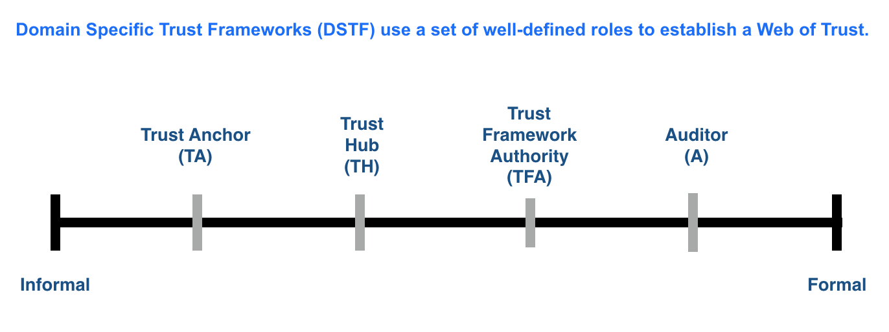

# Trust Framework Persona
```
Last Revised: 22AUG2018
Prior Versions (link):

```

## Persona

>This section pertains to the recognition and description of stakeholders and actors in the network.

1. *Steward* is an entity that has been approved by the governing agent for the network. A Steward can:
	1. Operate ONLY one validator node.
	1. Operate more than one observer nodes.
	1. Only function in either Validator or Observer role at a given time.
> COMMENT ON ABOVE: this is something for TGB (?) to decide/work through.

## Spectrum of Trust



* STFv2 will introduce these persona concepts
* STFv3 will define the BLT agreements for a TFA and certified Auditors for the underlying Sovrin Network. Clearly, the TFA will be the Sovrin Foundation.
* DSTF will define ecosystem specific BLT agreements for each role.


## Guidance
1. A Steward that uses a Hosting Provider must ensure that the Hosting Provider operates the Steward's server(s) in accordance with the relevant policies in the Sovrin Trust Framework. The Steward is still responsible for compliance with these policies.

1. Anyone can be a Hosting Provider, not just Stewards. A Steward should be able to hire a 3rd party to aid it with its obligations.

1. A Domain Specific Trust Framework (DSTF) SHOULD provide guidance with respect to the use of Hosting Providers.

1. The STFv2 normative documents should encourage a DSTF to consider the use of a certification method or a Hosting Provider Agreement for prospective Hosting Providers.
