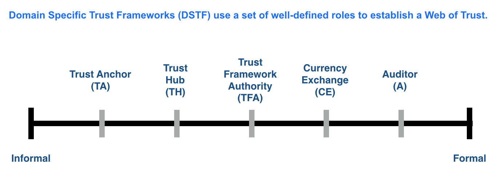

# Trust Framework Persona
```
Last Revised: 22AUG2018
Prior Versions (link):

```

## Persona

>This section pertains to the recognition and description of stakeholders and actors in the network.

1. *Steward* is an entity that has been approved by the governing agent for the network. A Steward can:
	1. Operate ONLY one validator node.
	1. Operate more than one observer nodes.
	1. Only function in either Validator or Observer role at a given time.
	
STF2 Glossary: **Steward.** An Organization invited by the Sovrin Foundation to operate a Node. A Steward must meet the Steward Qualifications and agree to the Steward Obligations defined in the Sovrin Trust Framework. A Steward can run either a validator or an observer node.

> REMAINDER OF THESE GLOSSARY TERMS ARE ALREADY IN THE STF2 GLOSSARY. 

1. *Certified Issuer Credential* A digital certificate indicating that the Issuer is authorized to issue Credentials that are governed by a Trust Framework.

1. *Certified Auditor Credential* A digital certificate indicating that the Auditor is recognized by a Trust Framework as an authorized oversight authority.

1. *Trust Framework Authority (TFA)* The Identity Owner (typically an Organization) that governs a particular Trust Framework. The TFA is responsible under a particular Trust Framework as the issuer of Certified Issuer and Auditor Credentials for Identity Owners that are members of that particular Trust Framework and that are authorized to issue credentials or perform oversight activities under that particular Trust Framework.

1. *Trust Anchor* A specialized Issuer, that is registered (DID) with the Sovrin Network by a TFA. A Trust Anchor is authorized to issue credentials in association with a specific Trust Framework. A Trust Anchor performs both vetting and issuance of credentials. While a basic  Issuer does not serve as a root of trust, a Trust Anchor performs the required vetting, due diligence, regulatory compliance and other tasks needed to establish confidence in making a claim about an identity trait before such claims can be used in the generation of a credential.

1. *Trust Hub* A DID service or registry that provides a list of the authorized Trust Anchors. The listed DIDs may be formally managed under a particular Trust Framework; or informally managed (i.e. no Trust Framework in place).

1. *Trust Framework Auditor* An authorized individual or organization that provides formal audits as indicated under a particular Trust Framework. Each Trust Framework defines its own audit and certification requirements.

1. *Hosting Provider*: A Data Processor that has been commissioned by an approved Steward (Data Controller) to manage the operations (either on-premise or in the cloud) of the Steward nodes (validator, observers). Stewards remain contractually obligated to the Sovrin Foundation regardless of their use of a Hosting Provider. Depending on the terms of a Trust Framework, a Hosting Provider may need to be certified or may need to agree to a Hosting Provider Agreement contract with the Sovrin Foundation.

1. *Currency Exchange*: An entity that has been approved by the TFA for the STF2 or a specific DSTF to perform lifecycle management services associated with a utility token. These entities provide services such as:
	* Buying Sovrin Tokens with fiat or other types of tokens
	* Exchanging Sovrin Tokens into fiat or other types of tokens
	* Automated Wallet loading services (once balance gets below a threshold)

## Spectrum of Trust



* STFv2 will introduce these persona concepts
* STFv3 will define the BLT agreements for a TFA and certified Auditors for the underlying Sovrin Network. Clearly, the TFA will be the Sovrin Foundation.
* DSTF will define ecosystem specific BLT agreements for each role.


## Guidance
1. A Steward that uses a Hosting Provider must ensure that the Hosting Provider operates the Steward's server(s) in accordance with the relevant policies in the Sovrin Trust Framework. The Steward is still responsible for compliance with these policies.

1. Anyone can be a Hosting Provider, not just Stewards. A Steward should be able to hire a 3rd party to aid it with its obligations.

1. A Domain Specific Trust Framework (DSTF) SHOULD provide guidance with respect to the use of Hosting Providers.

1. The STFv2 normative documents should encourage a DSTF to consider the use of a certification method or a Hosting Provider Agreement for prospective Hosting Providers.
